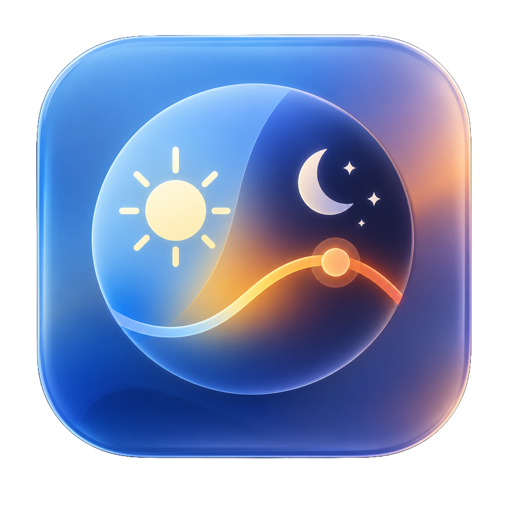
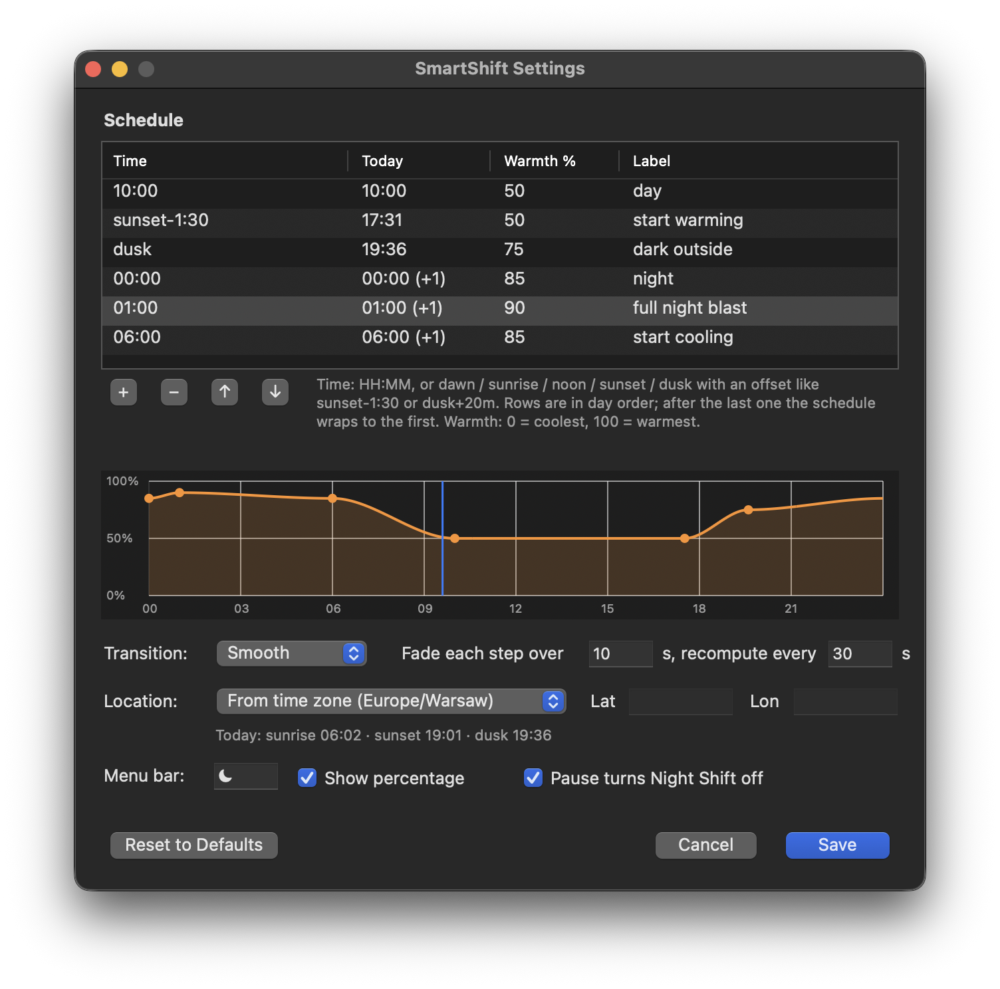

<p align="center">
  
</p>

<h1 align="center">SmartShift</h1>

<p align="center">
  Night Shift that follows the sun.<br>
  A tiny macOS menu bar app that keeps Night Shift on all day and glides its warmth so slowly you never see it change.
</p>

<p align="center">
  
  
  
</p>

<p align="center">
  
</p>

---

## Why

Screens are bright, blue-rich light sources. In the evening that kind of light tells
your body it is still daytime: research links it to later melatonin release and a
harder time falling asleep. A warmer screen takes part of that blue away, and it is
simply easier on tired eyes.

macOS already has Night Shift, but its schedule is a switch: one fixed warmth that
snaps on at sunset and off at sunrise. The jump is what people notice, and what makes
many of them turn Night Shift off again. There is no in-between during the day, no
"warmer as the night goes on", and a fixed clock schedule is wrong for half the year
because sunset moves by hours between June and December.

SmartShift fixes all of that:

* **Always a little warm.** A mild tint during the day, so the evening ramp starts
  from somewhere comfortable instead of from bright white.
* **Imperceptible change.** The warmth moves in tiny steps over hours. Your eyes adapt
  along with it, the same way you never see the sky turn golden before sunset.
* **Follows the seasons.** "Start warming before sunset" and "be at 75 % when it is
  dark" are computed from the real sunset and dusk times for where you are.
* **Warmest when it matters.** Late evening ramps up further, holds through the
  night, and eases back in the morning.
* **Apple's own colour engine.** It drives the real Night Shift, so colours look
  exactly like Night Shift always does. No gamma-table hacks, no colour profile edits.

After a couple of days you stop thinking about it. That is the point.

## The default schedule

| When                       | Warmth | What is happening                       |
| -------------------------- | ------ | --------------------------------------- |
| 10:00                      | 50 %   | daytime level, held all day             |
| 1 h 30 min before sunset   | 50 %   | warming starts                          |
| civil dusk (it got dark)   | 75 %   | follows the seasons via real sunset     |
| 00:00                      | 85 %   | night level, held for six hours         |
| 06:00                      | 85 %   | cooling starts                          |
| 10:00 next day             | 50 %   | back to daytime                         |

"Warmth" is the position of the Night Shift colour-temperature slider in System
Settings: 0 is coolest, 100 is warmest. Every number and time above is yours to
change in the Settings window.

## Install (as a macOS app)

Five minutes, no Xcode, no developer account. SmartShift is written in Python and
builds itself into a normal, self-contained `SmartShift.app`.

**1. Get a framework build of Python.** Any of these works:

```bash
brew install python            # Homebrew (install Homebrew first from https://brew.sh)
# or download the installer from https://www.python.org/downloads/macos/
```

(The default `python3` that comes with Xcode's command line tools, and pyenv builds,
can run SmartShift but cannot package it into an app.)

**2. Clone and build:**

```bash
git clone https://github.com/<your-username>/smart-shift.git
cd smart-shift
make install-app
```

This builds `dist/SmartShift.app`, copies it to `/Applications`, and opens it. The
first build creates a private build environment and takes a minute or two.

**3. Look at the menu bar.** A `☾ 85%` style item appears (the percentage is the
current warmth). There is no Dock icon. If Night Shift was off, it is now on, and the
Night Shift schedule in System Settings is set to *Off* while SmartShift runs so
macOS does not fight it.

**4. Make it start at login.** Click the menu bar item and choose **Start at Login**.
SmartShift shows up under *System Settings → General → Login Items & Extensions →
Open at Login* like any other app. If macOS asks you to approve it there, do.

**5. Adjust to taste.** Choose **Settings…** (⌘,) in the menu. See *Using it* below.

To update later: `cd smart-shift && git pull && make install-app`. Your settings
and login item survive.

### Sharing the built app

`dist/SmartShift.app` is self-contained (Python included, about 40 MB) and can be
zipped and sent to someone else. It is only ad-hoc signed, so on their Mac the first
launch needs right-click → *Open*, or:

```bash
xattr -d com.apple.quarantine /Applications/SmartShift.app
```

### Running from source instead

For hacking on it, or if you just do not want an app bundle:

```bash
make setup      # creates .venv and installs the two dependencies
make run        # runs in the terminal; Ctrl+C or menu → Quit stops it
```

Any Python 3.9+ works for this. `make login-on` / `make login-off` manage a
LaunchAgent that starts `/Applications/SmartShift.app` if you have it, otherwise the
checkout (don't move the folder afterwards). The app and the source version share one
lock, so only one runs at a time.

## Using it

### The menu

* **Night Shift 72 % · warming to 75 % by 19:36** – what it is doing right now.
* **Next / Sun / Today's Keyframes** – today's plan with real times, and today's
  sunrise, sunset and dusk for your location.
* **Pause ▸ 15 min / 1 h / 3 h / until I resume** – stops the schedule (and, by
  default, turns Night Shift off) when you need true colours for a while. **Resume**
  appears while paused, and the timed pauses resume by themselves.
* **Settings…** – the settings window. **Edit Config File…** opens the underlying
  JSON instead; **Reload Config** re-reads it now.
* **Start at Login** – toggle the Login Items entry.
* **Quit SmartShift** – puts your previous Night Shift mode, schedule and strength
  back exactly as they were.

### The Settings window

* **Schedule table.** Click a time, warmth or label to edit it in place. **+** adds a
  row after the selected one, **−** removes it, **↑ ↓** reorder. Rows are in day
  order; after the last one the schedule wraps to the first.
  * A time is a clock time (`21:30`) or a solar event (`dawn`, `sunrise`, `noon`,
    `sunset`, `dusk`) with an optional offset: `sunset-1:30`, `dusk+20m`,
    `sunrise + 2h`.
  * The **Today** column shows when each row actually lands today, so `sunset-1:30`
    reads as `17:31` next to it. `(+1)` means the next calendar day.
  * The graph is today's curve, keyframes as dots, and a marker at the current time.
  * Mistakes are explained in red under the table, and **Save** stays disabled until
    they are fixed.
* **Transition.** *Smooth* eases gently into and out of every keyframe; *Linear* moves
  at a constant rate. *Fade each step over* is how long Night Shift takes to blend
  each small change; *recompute every* is how often the target is recalculated.
* **Location.** *From time zone* guesses your position from the system time zone,
  with no network and no permission prompts, accurate to roughly the nearest big city.
  Pick *Coordinates* and type your latitude and longitude for exact sunset times.
* **Menu bar.** The symbol shown in the menu bar, and whether the percentage follows it.
* **Pause turns Night Shift off.** Untick this if Pause should just stop the schedule
  and leave Night Shift at whatever you set by hand.

**Save** applies immediately. **Reset to Defaults** restores the schedule above.

### Things to know

* **While it runs, SmartShift owns Night Shift.** If you drag the Night Shift slider
  or turn Night Shift off, it drifts back to the schedule within half a minute. Use
  *Pause* when you want it out of the way.
* **Quitting restores your old settings.** Mode, custom schedule and strength are
  captured at launch and put back on quit. If the app is ever killed without a chance
  to do that, just pick your schedule again under *System Settings → Displays → Night
  Shift*.
* **Nothing else happens on its own.** No notifications, no network access, no
  location permission, no data collected. State lives in the menu and in
  `~/Library/Logs/SmartShift.log`.
* Sleep/wake and time-zone changes trigger an immediate update.

## How it works

* Night Shift is controlled through Apple's private `CoreBrightness` framework, the
  same `CBBlueLightClient` object System Settings uses. SmartShift asks it for the
  current strength and sets a new one with a short fade. That is why the result is
  indistinguishable from moving the slider yourself.
* A timer recomputes the target every 30 seconds. Between keyframes the warmth is
  interpolated (smoothstep by default); after the last keyframe of the day the curve
  wraps around to the first one on the next day.
* Sunrise, sunset and civil twilight come from the standard *Almanac for Computers*
  solar algorithm, accurate to a minute or two. Your location is guessed from the
  time zone using the coordinates the tz database ships for each zone, unless you
  enter your own.
* Everything is stored in `~/.config/smart-shift/config.json`. The Settings window
  edits it for you, but the file is plain JSON and can be edited by hand; SmartShift
  reloads it whenever it changes. See [`config.example.json`](config.example.json).

<details>
<summary>Example configurations</summary>

Tie the morning to sunrise instead of fixed times:

```json
"keyframes": [
  { "at": "sunrise+3h",  "strength": 45 },
  { "at": "sunset-1:00", "strength": 45 },
  { "at": "dusk",        "strength": 75 },
  { "at": "23:00",       "strength": 90 },
  { "at": "sunrise-1h",  "strength": 90 }
]
```

Plain clock times only, no sun maths at all:

```json
"keyframes": [
  { "at": "09:00", "strength": 40 },
  { "at": "18:00", "strength": 40 },
  { "at": "21:00", "strength": 80 },
  { "at": "06:00", "strength": 80 }
]
```

Other keys: `"easing": "smooth" | "linear"`, `"location": {"latitude": 52.23,
"longitude": 21.01}` (or both `null`), `"fade_seconds"`, `"update_interval_seconds"`,
`"pause_turns_off"`, `"menubar": {"icon": "☾", "show_percent": true}`.
</details>

## FAQ

**Is this safe? Will it break with a macOS update?**
It uses a private, undocumented Apple API, which is what every third-party Night
Shift tool does. It has been stable for many macOS versions (tested on macOS 26), but
Apple could change it. Nothing it does is persistent beyond Night Shift's own
settings, which you can always reset in System Settings.

**Why isn't it on the Mac App Store?**
Private APIs are not allowed there. Building it yourself from source, or sharing the
built app, is the intended way to get it.

**The sunset time in the menu is off by half an hour.**
The time-zone guess uses your zone's principal city. Enter your coordinates in
Settings → Location for exact times.

**I live far north / south and "dusk" never happens in summer.**
On days when the sun does not set (or rise), those keyframes fall back to fixed
times, 19:30 for sunset and 20:00 for dusk (06:30 / 06:00 in the morning), and the
menu marks them.

**Can I keep Night Shift's own sunset-to-sunrise schedule as well?**
No; the two would fight. SmartShift sets the macOS schedule to *Off* while it runs
and restores it when you quit.

**Does it work with external displays?**
Night Shift itself decides which displays it can tint (most external monitors are
supported). SmartShift only changes the strength, so whatever Night Shift covers,
SmartShift covers.

**Where are the logs?**
`~/Library/Logs/SmartShift.log`. The About box shows the paths.

## Uninstall

Quit SmartShift from its menu first (that restores your Night Shift settings), then:

```bash
rm -rf /Applications/SmartShift.app            # its Login Items entry goes with it
rm -rf ~/.config/smart-shift ~/Library/Logs/SmartShift.log*
rm -f  ~/Library/LaunchAgents/com.smartshift.agent.plist   # only if you used the source-checkout login item
rm -rf /path/to/smart-shift                    # the source folder
```

## Development

```bash
make setup                          # dev environment (.venv)
make test                           # 33 unit tests: schedule maths, solar maths, config
make show                           # print today's plan and current Night Shift state
.venv/bin/python -m smartshift -v   # run from source with debug logging
.venv/bin/python -m smartshift --settings   # open only the settings window
make app                            # build dist/SmartShift.app without installing
```

```
smartshift/
  nightshift.py    CoreBrightness bridge (CBBlueLightClient via PyObjC)
  solar.py         sunrise / sunset / twilight, time-zone location guess
  schedule.py      keyframes, resolution for a given day, interpolation
  config.py        config.json loading, validation, saving
  engine.py        glue: config + location -> Schedule
  app.py           the menu bar app (rumps) and control loop
  settings_ui.py   the Settings window (AppKit)
  loginitem.py     Start at Login (SMAppService in the app, LaunchAgent from source)
  cli.py           --show
setup.py           py2app bundle description; packaging/SmartShift.py is the entry script
assets/            icon.png (source), SmartShift.icns, settings.png
```

Pull requests and issues are welcome. If you change the icon, regenerate
`assets/SmartShift.icns` with `sips` and `iconutil`.

## Acknowledgements

* The `CBBlueLightClient` interface was worked out by the community around
  [smudge/nightlight](https://github.com/smudge/nightlight) and similar tools.
* Built with [rumps](https://github.com/jaredks/rumps), [PyObjC](https://pyobjc.readthedocs.io/)
  and [py2app](https://py2app.readthedocs.io/).

## License

[MIT](LICENSE)
